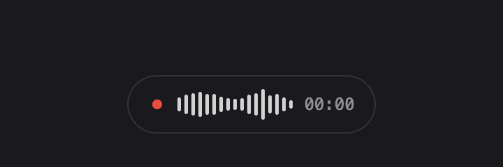
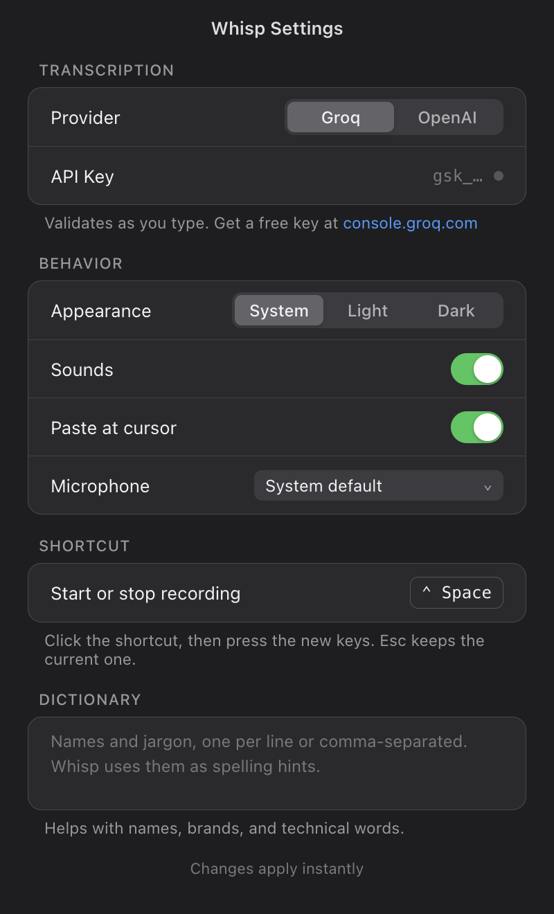

# Leise

Voice to text, anywhere you type. A macOS menubar app.



Press `⌃Space`, speak, press it again. Your words land wherever your cursor is.

## How it works

1. A global hotkey (default `⌃Space`, configurable) starts recording. A small overlay shows a live waveform while you speak.
2. Audio goes to the provider you pick, on your own API key: Groq (`whisper-large-v3-turbo`, the default) or OpenAI (`whisper-1`).
3. The transcript is pasted at your cursor and kept in a local history, the last 20, reachable from the menubar.

## Features

- Live waveform overlay with recording, transcribing, and inserted states, in light and dark
- API keys stored encrypted through the macOS Keychain, never in plain text
- Dictionary: list your names and jargon once, Leise uses them as spelling hints
- Copy Last and recent transcriptions in the menubar menu
- Configurable shortcut, microphone picker, sounds and auto-paste toggles
- `Esc` cancels quietly; the transcript still lands in history
- `⏎` also stops a recording



## Install

You need Node 18+ and an API key: [console.groq.com](https://console.groq.com/keys) (free) or [platform.openai.com](https://platform.openai.com/api-keys).

```bash
git clone https://github.com/abdelilahDR/voice-dictation-mac.git
cd voice-dictation-mac
npm install
npm start
```

The first run walks you through permissions and your key, and ends with a test dictation.

To build a standalone app: `npm run build`, then install from `dist/`.

## Permissions

- **Microphone** — recording
- **Accessibility** — pasting at your cursor (System Settings → Privacy & Security → Accessibility)

## Troubleshooting

- **Nothing pastes.** Grant the Accessibility permission. The text is still on your clipboard and in the menubar history.
- **The shortcut does nothing.** Another app may hold it. Pick a different combo in Settings, it re-registers live.
- **"Couldn't reach" errors.** Check your connection and that your key is valid; Settings validates it as you type.

## License

MIT © Moonsight
